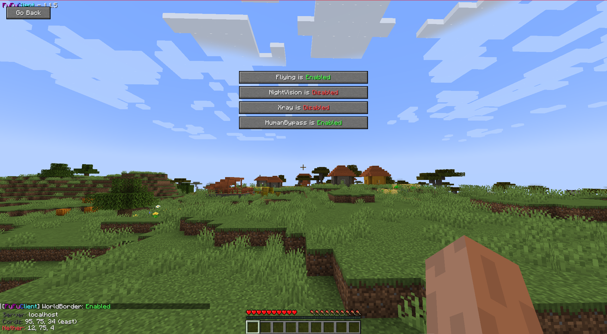

<div align="center"></div>


# 🎡 FuFu Client

<div align="center">

[](https://github.com/IMXNOOBX/FuFuClient/actions) 

</div>

A BlockGame client mod I made with the purpose of learning java and playing in LiveOverflow's server. Mod idea inspired by LiveOverflow.



# 📣 Whats New

> 1.1.7 - Changed some features to improove the look, soon more updates!!!<br>
> 1.1.5 - Fixed many issues, implemented kaihack's bypass, improved xray<br>
> 1.1.4 - Added watermak, coordinates, server... while in game<br>
> 1.1.3 - Added some chat commands, fixed flight anti kick<br>
> 1.1.2 - Added some new features, NightVision, Flight<br>
> 1.1.1 - Fixed issue with .gitignore file ignoring gradle-wrapper.jar<br>
> 1.1.0 - Nothing new yet just Fabric Example Mod

## 🔺 Features

```diff
+ Working Features 
	• NativeUi - Minecraft Native ui to interact with the features. 
	• LiveOverflow Mode - Enables some features to properly play in LiveOverflow's server .
	• NightVision - aka Fulbright.
	• Flight - Flight like a bird, AntiKick and NoFall together.
	• XRay - Simple based xRay mod.
	• Chat Commands: 
	    - fufuhelp: little help, with the description of each command.
	    - fakegamemode, Change your gamemode clientside.
	    - teleport, Teleport to close coordinates.
	    - hud, toggles in game items while i make each item toggle.
	                    toggle: enables/disables the hud
                        coords: enables/disables the coordinates in the hud
                        ip: enables/disables the IP in the hud. Hoping to not leak the server ip again :D
                        watermak: enables/disables the coolest watermark ever.
- To Do
    • WorldBorder Bypass - So you can interact and dont die outside it.
	• More ideas when i get the ip to join the server :c
```

## 🪁 Simple Use

***IntelliJ***

> gradlew genIdeaWorkspace

***Eclipse***

> gradlew genSources eclipse

***Other IDE's***

Use [this link](https://fabricmc.net/wiki/tutorial:setup) for more information.

***Compile***

> gradlew build

## 🎯 Recommended Mods

***ViaFabric***

> [ViaFabric](https://github.com/ViaVersion/ViaFabric) is the mod I recommend you, to be able to connect to different versions from 1.19.2.
